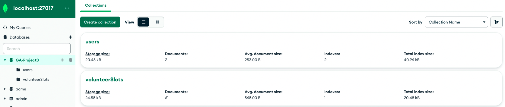
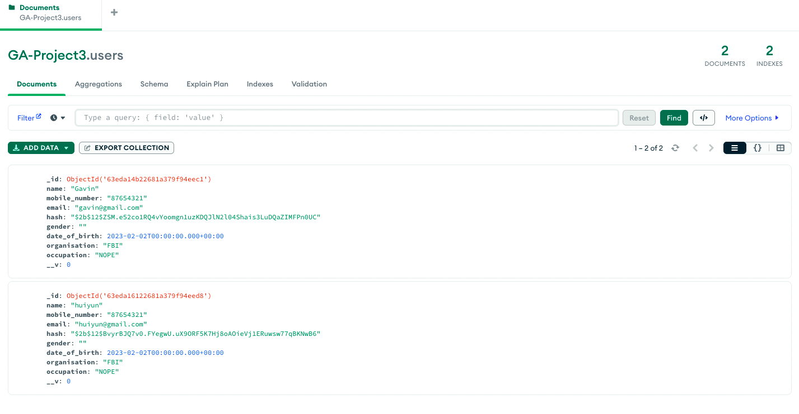

# Willing Hearts

Willing Hearts is a charity, wholly run by volunteers, apart from a handful of staff. This website is a revamp from the current website, with updated UIUX changes. It allows the public to explore what the organisation is about, what they can contribute to. The website also allows the public to sign up as volunteers, via booking up a slot, and filling in the particulars, and the number of participants. New participants will be added to the database, and volunteers are able to see the availability slots for specific days via our booking application.

This repository is for the backend. You may find the frontend repository [HERE](https://github.com/Glow-in-the-dark/GA-Project3-Frontend).

<kbd> </kbd>
<kbd> </kbd>
<kbd> </kbd>

## Technologies Used

1. React for frontend.
2. MongoDB as the database for the backend.
3. Express for the middleware.
4. Bcrypt for hashing user passwords.
5. Jsonwebtoken and uuid for JWT authentication

## General Approach

1. Crafted VolunteerSlots schema with these in mind:
   - Allow flexibility in number of slots and timings across different days (simply creating more/less objects in the orig_slots_available array). This links back to the Frontend (eg. slot timings are not hardcoded on Frontend).
   - Easy updating when user creates a new sign in (simply pushing a new object into the sign_ups array).
2. Used MVC concept to craft the dataflow required by the database and design the endpoints accordingly
3. Creating the controllers for endpoints which integrates functionality of multiple endpoints (eg. Created an endpoint that creates new user or logs in existing user at once, instead of trying to call 2 different existing endpoints).

## Limitations & Future work

- Touch up the styling for Volunteer Sign Up form (in progress)
- Research on how to use SVG images for highlighting words in Headers/NavBars
- Creating authenticated pages for admin users to maintain the site (eg. adding in future news articles, change pictures)
- Research on how to upload files in forms and save to database (Volunteer Sign Up Form)
